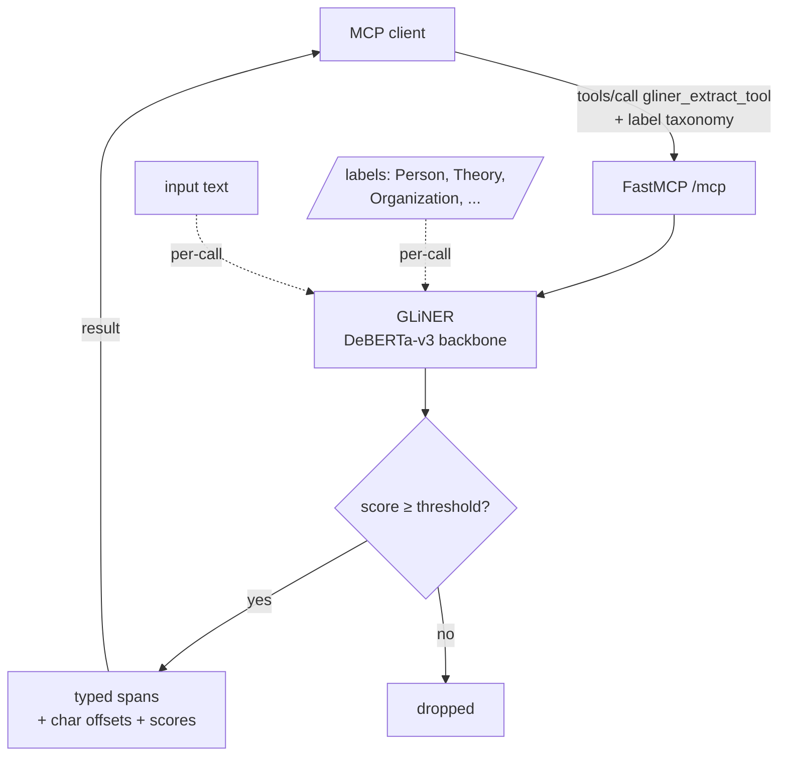

# concept-gliner

An MCP server that finds named entities in text where **you supply the
label set per call**. Want spans tagged as `Person`, `Theory`, `Drug`,
`MaterialProperty`? Just ask for those labels in the request — no
fine-tuning required.

Part of the `concept-*` family of single-tool MCP servers (peer:
[`concept-keybert`](../concept-keybert/), [`concept-spacy`](../concept-spacy/)).
See the [root README](../../README.md) for a side-by-side comparison of when
to use which.

## In plain English

Traditional named-entity-recognition (NER) models are *closed-schema*:
they're trained to find a fixed handful of types — `PERSON`,
`ORGANIZATION`, `LOCATION`, etc. — and they can't recognize anything
outside that taxonomy. (spaCy's built-in NER is the classic example.)

GLiNER is different. It was trained to take **arbitrary label strings**
at inference time and find spans that match them. You can ask for
`"Theory"` on one call and `"Drug"` on the next without retraining.
The cost: a heavier model (~800 MB) and per-call inference is slower
than spaCy.

When you'd reach for this: domain-specific extraction where the
entity types aren't in spaCy's default taxonomy (e.g. cybersecurity
artifacts, biomedical terms, philosophical concepts) and the cost of
a labeled dataset + fine-tune isn't justified.

## Glossary

- **MCP (Model Context Protocol)**: an open protocol from Anthropic for
  exposing tools to LLM-based agents. This server speaks MCP over HTTP.
- **NER (Named-Entity Recognition)**: pulling typed spans out of text —
  e.g. "Albert Einstein" → Person, "Princeton University" → Organization.
- **Zero-shot**: the model handles labels it was never explicitly trained
  on. You supply them at inference time.
- **GLiNER**: the open-source zero-shot NER model used here. Authored by
  Urchade Zaratiana et al. Backbone is a fine-tuned DeBERTa-v3.
  <https://github.com/urchade/GLiNER>
- **DeBERTa-v3**: a Microsoft transformer-encoder architecture; the
  default `urchade/gliner_medium-v2.1` checkpoint is built on
  DeBERTa-v3-large. ~800 MB of weights.
- **Threshold**: minimum model confidence (0–1) for a span to be
  returned. Default `0.5`. Raise it for higher precision, lower it
  for higher recall.
- **flat_ner**: when `true` (default), overlapping spans aren't
  allowed — the model picks the highest-scoring non-overlapping set.
  Set `false` for nested NER (e.g. "Princeton University" containing
  "Princeton" as both an `Organization` and a `Location`).

## Flow



The model is loaded **once at session startup** and stays resident. The
label taxonomy is *not* baked into the model — it's evaluated fresh
on every call against the labels you pass in.

## Example

Request:

```json
{
  "jsonrpc": "2.0",
  "id": 3,
  "method": "tools/call",
  "params": {
    "name": "gliner_extract_tool",
    "arguments": {
      "text": "Albert Einstein developed the theory of relativity at Princeton University.",
      "labels": ["Person", "Organization", "Theory", "Location"],
      "threshold": 0.5
    }
  }
}
```

Response (structured result):

```json
{
  "tool": "gliner",
  "labels_used": ["Person", "Organization", "Theory", "Location"],
  "threshold": 0.5,
  "entities": [
    { "text": "Albert Einstein",      "label": "Person",       "start": 0,  "end": 15, "score": 0.993 },
    { "text": "theory of relativity", "label": "Theory",       "start": 30, "end": 50, "score": 0.787 },
    { "text": "Princeton University", "label": "Organization", "start": 54, "end": 74, "score": 0.747 }
  ]
}
```

Note how `Theory` was correctly identified — that label doesn't exist
in spaCy's built-in NER taxonomy, but GLiNER handles it because you
provided it at call time.

### Tool arguments

| Argument     | Type             | Default | Notes |
|--------------|------------------|---------|-------|
| `text`       | `string`         | required | The input text. |
| `labels`     | `array[string]`  | required | Non-empty. The label taxonomy for this call. |
| `threshold`  | `float`          | `0.5`   | Min confidence, `[0, 1]`. |
| `flat_ner`   | `bool`           | `true`  | Disallow overlapping spans. |

## Run

```bash
docker run -p 8000:8000 ghcr.io/darkquasar/fracta-mcp-servers/concept-gliner:latest
```

Then POST MCP traffic to `http://localhost:8000/mcp`.

### Env vars

| Variable                | Default                          | What it does |
|-------------------------|----------------------------------|--------------|
| `CONCEPT_GLINER_HOST`   | `0.0.0.0`                        | Bind address. |
| `CONCEPT_GLINER_PORT`   | `8000`                           | Bind port. |
| `CONCEPT_GLINER_MODEL`  | `urchade/gliner_medium-v2.1`     | Any GLiNER checkpoint id from Hugging Face. |
| `LOG_LEVEL`             | `INFO`                           | `DEBUG`/`INFO`/`WARNING`/`ERROR`. |

## Dev

```bash
cd servers/concept-gliner
uv sync
uv run python -m concept_gliner.server
```

## Resources

Suggested Kubernetes resources, set in `server.yaml`:

| | Request | Limit |
|---|---|---|
| **Memory** | `2Gi`  | `4Gi`   |
| **CPU**    | `500m` | `4000m` |

Sized for: ~800 MB (gliner_medium DeBERTa-v3-large weights) + ~600 MB
(torch CPU + MKL libs) + transformers/tokenizer overhead + Python
runtime. DeBERTa inference can saturate multiple cores during a call;
the `4000m` limit lets it burst, and the lower request keeps the pod
schedulable at idle.

This is the heaviest server in the `concept-*` family. If your fracta
deployment is memory-constrained and you only need standard
`PERSON`/`ORG`/`GPE` entities, prefer [`concept-spacy`](../concept-spacy/)
(256Mi/512Mi memory, an order of magnitude lighter).

These are *informed estimates*, not measured under sustained load. If
you put this in production behind real traffic, profile RSS with
`kubectl top pod` and tune.

## Notes

- **Image size: ~4.6 GB.** The bulk is PyTorch (CPU build) plus the
  DeBERTa-v3-large GLiNER checkpoint. Weights are pre-downloaded to
  `/opt/models` at image build time. This is the heaviest server in
  the `concept-*` family — if you only need standard `PERSON` / `ORG` /
  `GPE`, prefer [`concept-spacy`](../concept-spacy/) instead.
- **Don't `curl /mcp` to test health.** Streamable-HTTP wants POST with
  the right Accept headers; bare GET returns 406. The container's
  `HEALTHCHECK` is a TCP-level probe.
- **Session matters.** Threading `mcp-session-id` across requests keeps
  the model resident; sending session-less requests reloads it each
  time (per MCP SDK semantics).
- **Threshold tuning.** Raise above `0.5` if you're getting noisy
  spurious entities; lower it if a known entity isn't being picked up.
  Watch the `score` field on results to calibrate.
