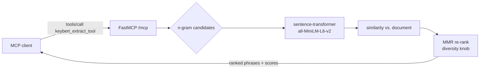

# concept-keybert

An MCP server that ranks the most representative phrases in a chunk of text.
Drop in a paragraph, get back a short list of phrases that summarize what
it's "about," each with a relevance score.

Part of the `concept-*` family of single-tool MCP servers (peer:
[`concept-gliner`](../concept-gliner/), [`concept-spacy`](../concept-spacy/)).
See the [root README](../../README.md) for a side-by-side comparison of when
to use which.

## In plain English

Imagine you pasted in a Wikipedia paragraph and asked "what's this about,
in 5 phrases?" That's what this tool does. It doesn't summarize sentences
or explain anything — it just surfaces the phrases that look most
*characteristic* of the input, ranked by how representative they are.

Under the hood: every phrase in the text is turned into a vector (a list
of numbers), every vector is compared to the vector of the whole document,
and the phrases that are closest to the document's "meaning" win. Then
a diversity step ensures the top picks aren't all near-duplicates of each
other.

## Glossary

- **MCP (Model Context Protocol)**: an open protocol from Anthropic for
  exposing tools to LLM-based agents. This server speaks MCP over HTTP;
  agents call it just like any other MCP server.
- **KeyBERT**: a small open-source library that uses sentence embeddings
  to rank candidate keyphrases against the whole document. Authored by
  Maarten Grootendorst. <https://github.com/MaartenGr/KeyBERT>
- **sentence-transformer / embedding**: a neural model that maps a piece
  of text to a fixed-length vector such that semantically similar texts
  have nearby vectors. The default backbone here is `all-MiniLM-L6-v2` —
  small, CPU-friendly, ~90 MB.
- **MMR (Maximal Marginal Relevance)**: a re-ranking step that, after
  picking the top-scoring phrase, downweights candidates that are too
  similar to it before picking the next. The `diversity` knob (0.0–1.0)
  controls how aggressive that downweighting is. 0 = pure relevance,
  redundancy allowed. 1 = max diversity, possibly off-topic.
- **n-gram**: a contiguous sequence of N words. `keyphrase_ngram_min=1`
  and `keyphrase_ngram_max=3` means "consider single words, bigrams, and
  trigrams as candidate phrases."

## Flow



The sentence-transformer model is loaded **once at session startup** and
stays resident — every `tools/call` against the same MCP session hits
the warm model.

## Example

Request (JSON-RPC over MCP `tools/call`):

```json
{
  "jsonrpc": "2.0",
  "id": 2,
  "method": "tools/call",
  "params": {
    "name": "keybert_extract_tool",
    "arguments": {
      "text": "Machine learning models extract patterns from training data. Deep neural networks learn hierarchical representations.",
      "top_n": 5
    }
  }
}
```

Response (the structured result; the `content[].text` JSON dump is
omitted for brevity):

```json
{
  "tool": "keybert",
  "keyphrases": [
    { "phrase": "learn hierarchical representations", "score": 0.627 },
    { "phrase": "training data",                      "score": 0.5338 },
    { "phrase": "extract patterns",                    "score": 0.508 },
    { "phrase": "deep",                                "score": 0.3525 },
    { "phrase": "machine",                             "score": 0.2293 }
  ]
}
```

Scores are cosine similarities in the embedding space — bounded roughly
in `[0, 1]`, higher = more representative of the input. Don't read them
as probabilities; treat them as a ranking signal.

### Tool arguments

| Argument                | Type      | Default       | Notes |
|-------------------------|-----------|---------------|-------|
| `text`                  | `string`  | required      | The input text. |
| `top_n`                 | `int`     | `10`          | How many phrases to return. |
| `keyphrase_ngram_min`   | `int`     | `1`           | Min words per candidate phrase. |
| `keyphrase_ngram_max`   | `int`     | `3`           | Max words per candidate phrase. |
| `use_mmr`               | `bool`    | `true`        | Apply MMR diversity re-rank. |
| `diversity`             | `float`   | `0.7`         | MMR strength, `[0, 1]`. |
| `stop_words`            | `string?` | `"english"`   | Stopword list to filter (or `null` for none). |

## Run

Via the published image:

```bash
docker run -p 8000:8000 ghcr.io/darkquasar/fracta-mcp-servers/concept-keybert:latest
```

Then POST MCP traffic to `http://localhost:8000/mcp`. A real MCP client
(the fracta gateway, the official `mcp` CLI, Anthropic's MCP Inspector)
will do the `initialize` → `tools/list` → `tools/call` handshake for
you, keeping the session-id sticky so the model only loads once.

### Env vars

| Variable                        | Default              | What it does |
|---------------------------------|----------------------|--------------|
| `CONCEPT_KEYBERT_HOST`          | `0.0.0.0`            | Bind address. |
| `CONCEPT_KEYBERT_PORT`          | `8000`               | Bind port. |
| `CONCEPT_KEYBERT_BACKBONE`      | `all-MiniLM-L6-v2`   | Any sentence-transformers model id. |
| `LOG_LEVEL`                     | `INFO`               | `DEBUG`/`INFO`/`WARNING`/`ERROR`. |

## Dev

```bash
cd servers/concept-keybert
uv sync
uv run python -m concept_keybert.server
```

## Resources

Suggested Kubernetes resources, set in `server.yaml`:

| | Request | Limit |
|---|---|---|
| **Memory** | `1Gi`  | `2Gi`   |
| **CPU**    | `250m` | `2000m` |

Sized for: ~90 MB (MiniLM-L6-v2) + ~600 MB (torch CPU + MKL libs) +
Python runtime. Sentence-transformer embedding benefits from a couple
of cores for batched ops — the `2000m` limit gives it room to burst
during request handling without starving neighbors at idle.

These are *informed estimates*, not measured under sustained load. If
you put this in production behind real traffic, profile RSS with
`kubectl top pod` and tune.

## Notes

- **Image size: ~2 GB.** Most of that is PyTorch (CPU build) and the
  sentence-transformer weights. The model is pre-downloaded into
  `/opt/models` at image build time so first request doesn't pay
  the download cost.
- **Don't `curl /mcp` to test health.** The streamable-HTTP transport
  requires `POST` with both `application/json` and `text/event-stream`
  in `Accept`; a bare `GET` returns `406 Not Acceptable`. The container's
  `HEALTHCHECK` is a TCP-level probe (it just verifies port 8000 is bound)
  for this reason.
- **Session matters.** A client that sends each request without
  threading the `mcp-session-id` header through will get a fresh session
  per request, which means the lifespan re-enters and the model reloads.
  This isn't a bug in this server — it's how the MCP SDK's stateful mode
  defines a session — but it's worth knowing if you're writing a test
  harness by hand.
