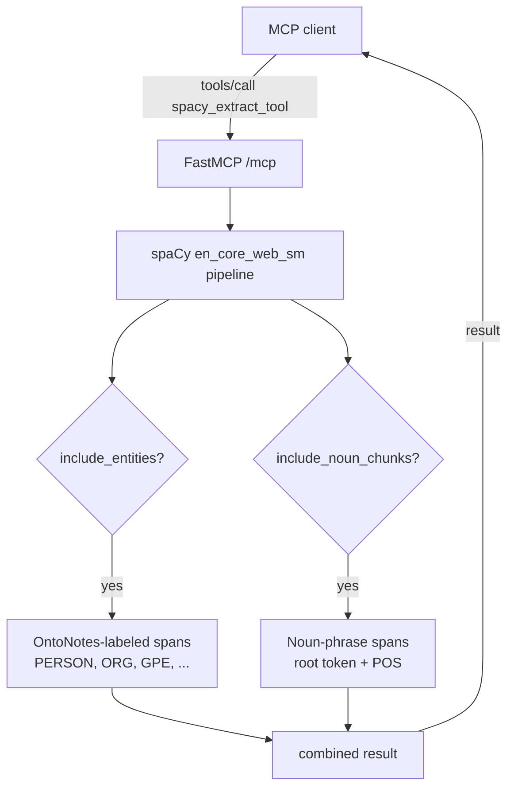

# concept-spacy

An MCP server for cheap, fast linguistic baseline extraction from text:
named entities (people, places, organizations, dates…) plus noun-phrase
chunks. Built on spaCy's classical pipeline — no neural transformers,
no GPU, no `torch` dependency. Smallest of the `concept-*` family by
far (~515 MB image vs. ~2–5 GB for the others).

Part of the `concept-*` family of single-tool MCP servers (peer:
[`concept-keybert`](../concept-keybert/), [`concept-gliner`](../concept-gliner/)).
See the [root README](../../README.md) for a side-by-side comparison of when
to use which.

## In plain English

Two things come back per request:

1. **Entities** — spaCy's built-in named-entity recognizer tags spans
   like "Apple Inc." → `ORG`, "Tim Cook" → `PERSON`, "Cupertino" → `GPE`.
   The label set is *fixed* (you can't ask for custom labels — for that
   use [`concept-gliner`](../concept-gliner/)).
2. **Noun chunks** — contiguous noun phrases extracted via spaCy's
   dependency parser. Useful as "things being talked about" anchors
   even when they're not named entities. "new products" is a noun chunk;
   it isn't an entity.

This is the right tool when you need a fast, deterministic anchor over
a lot of text and the standard `PERSON`/`ORG`/`GPE`/etc. taxonomy fits
your needs. It runs comfortably on CPU and a small VM.

## Glossary

- **MCP (Model Context Protocol)**: an open protocol from Anthropic for
  exposing tools to LLM-based agents. This server speaks MCP over HTTP.
- **NER (Named-Entity Recognition)**: pulling typed spans out of text.
- **spaCy**: industrial-strength NLP library for Python with closed-schema
  NER, POS tagging, dependency parsing, and more. <https://spacy.io>
- **`en_core_web_sm`**: the default English language pipeline shipped
  with spaCy. ~12 MB. The "sm" means small — there are also `_md`, `_lg`,
  and `_trf` (transformer-backed) variants.
- **POS (Part-Of-Speech)**: the grammatical category of a word — `NOUN`,
  `VERB`, `PROPN` (proper noun), `ADJ`, etc. Each token in the doc gets
  one.
- **Noun chunk**: a noun + its dependents (modifiers, determiners) that
  together form a noun phrase. In "the quick brown fox jumped" the noun
  chunk is `"the quick brown fox"` rooted at `fox`.
- **Built-in entity labels** (from OntoNotes 5): `PERSON`, `ORG`,
  `GPE` (countries/cities/states), `LOC` (other geo), `PRODUCT`, `EVENT`,
  `WORK_OF_ART`, `LAW`, `LANGUAGE`, `DATE`, `TIME`, `PERCENT`, `MONEY`,
  `QUANTITY`, `ORDINAL`, `CARDINAL`, `NORP` (nationalities/religious/
  political groups), `FAC` (facilities).

## Flow



The pipeline is loaded **once at session startup** — every `tools/call`
against the same MCP session hits the warm pipeline.

## Example

Request:

```json
{
  "jsonrpc": "2.0",
  "id": 4,
  "method": "tools/call",
  "params": {
    "name": "spacy_extract_tool",
    "arguments": {
      "text": "Apple Inc. announced new products in Cupertino. Tim Cook spoke about iPhones."
    }
  }
}
```

Response (structured result):

```json
{
  "tool": "spacy",
  "entities": [
    { "text": "Apple Inc.",  "label": "ORG",    "start": 0,  "end": 10 },
    { "text": "Cupertino",   "label": "GPE",    "start": 37, "end": 46 },
    { "text": "Tim Cook",    "label": "PERSON", "start": 48, "end": 56 },
    { "text": "iPhones",     "label": "ORG",    "start": 69, "end": 76 }
  ],
  "noun_chunks": [
    { "text": "Apple Inc.",   "root_text": "Inc.",     "root_pos": "PROPN", "start": 0,  "end": 10 },
    { "text": "new products", "root_text": "products", "root_pos": "NOUN",  "start": 21, "end": 33 },
    { "text": "Cupertino",    "root_text": "Cupertino","root_pos": "PROPN", "start": 37, "end": 46 },
    { "text": "Tim Cook",     "root_text": "Cook",     "root_pos": "PROPN", "start": 48, "end": 56 },
    { "text": "iPhones",      "root_text": "iPhones",  "root_pos": "PROPN", "start": 69, "end": 76 }
  ]
}
```

Note that "iPhones" is technically a PRODUCT but spaCy's small model
mis-labels it as `ORG` — a reminder that closed-schema models are only
as accurate as their training data. If precision matters more than
speed, run the same text through `concept-gliner` with a curated
label set instead (or upgrade to `en_core_web_trf` via
`CONCEPT_SPACY_MODEL`).

### Tool arguments

| Argument               | Type     | Default | Notes |
|------------------------|----------|---------|-------|
| `text`                 | `string` | required | The input text. |
| `include_entities`     | `bool`   | `true`   | Return the named-entity list. |
| `include_noun_chunks`  | `bool`   | `true`   | Return the noun-phrase list. |

Toggle either off if the caller only wants one side of the output —
slightly cheaper response payload.

## Run

```bash
docker run -p 8000:8000 ghcr.io/darkquasar/fracta-mcp-servers/concept-spacy:latest
```

Then POST MCP traffic to `http://localhost:8000/mcp`.

### Env vars

| Variable                | Default          | What it does |
|-------------------------|------------------|--------------|
| `CONCEPT_SPACY_HOST`    | `0.0.0.0`        | Bind address. |
| `CONCEPT_SPACY_PORT`    | `8000`           | Bind port. |
| `CONCEPT_SPACY_MODEL`   | `en_core_web_sm` | Any installed spaCy pipeline id. |
| `LOG_LEVEL`             | `INFO`           | `DEBUG`/`INFO`/`WARNING`/`ERROR`. |

To use a different spaCy pipeline (`en_core_web_md`, `_lg`, `_trf`, or
a non-English one) you'd need to bake it into a derived image — the
default image only ships `en_core_web_sm` to keep the size low.

## Dev

```bash
cd servers/concept-spacy
uv sync
uv run python -m spacy download en_core_web_sm
uv run python -m concept_spacy.server
```

## Resources

Suggested Kubernetes resources, set in `server.yaml`:

| | Request | Limit |
|---|---|---|
| **Memory** | `256Mi` | `512Mi` |
| **CPU**    | `100m`  | `1000m` |

Sized for: ~50 MB resident (en_core_web_sm) + Python runtime + uvicorn
overhead. Single-threaded inference, so CPU > 1 is wasted — the `1000m`
limit just allows brief bursts during request handling.

These are *informed estimates*, not measured under sustained load. If
you put this in production behind real traffic, profile RSS with
`kubectl top pod` and tune.

## Notes

- **Image size: ~515 MB.** Tiny, because there's no PyTorch dependency.
  The spaCy model wheel is installed into the venv at build time.
- **No torch, no GPU codepath.** spaCy's small model is pure CPU and
  fast (~milliseconds per request for short text). If you need
  transformer-backed quality, `CONCEPT_SPACY_MODEL=en_core_web_trf`
  exists but requires baking a heavier image with torch installed.
- **Don't `curl /mcp` to test health.** Streamable-HTTP wants POST with
  the right Accept headers; bare GET returns 406. The container's
  `HEALTHCHECK` is a TCP-level probe.
- **Pair with `concept-gliner`** for open-schema NER, or with
  `concept-keybert` for keyphrase ranking. spaCy is the cheap baseline;
  the other two add precision or flexibility at a real compute cost.
